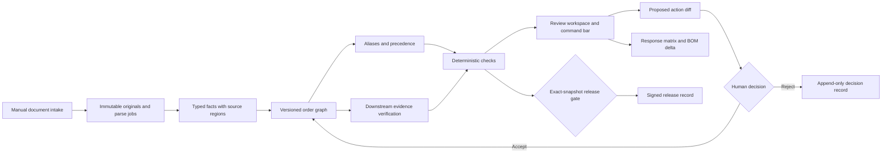

> The default product now uses the [comment-record architecture](comment-record-architecture.md). This document describes the retained engineering engine for later stages.

# Rivet: versioned engineering orders

## Product boundary

An order is the durable unit of work: its documents, sourced obligations, review rounds, configuration decisions, downstream artifacts, and release history. The UI presents an order feed, evidence-backed diffs, and a command bar. The first category is data-center low-voltage switchgear.

The shipped local workflow covers the brief's first three build stages. The outer integrations—shared inbox, drive watching, scan/vision reads, CAD, ERP and learning from reviewer history—have explicit extension boundaries. No connector is presented as running when it is not configured.

## Data flow

## Storage and invariants

PostgreSQL stores `Order` linked to the existing `Project`, alongside immutable `OrderRevision` snapshots, `OrderEvent` records, `OrderAction` proposals, `OrderWaiver` signatures, and `OrderRelease` records. The existing document/span and leased-job infrastructure is reused. Existing quotes remain intact and accessible under Quote tools.

- Originals are private local blobs and are never overwritten. `Span` IDs identify source text and its page/region or spreadsheet cells.
- Each relevant change appends a snapshot and event with version, checksum, author, and time. Source revisions retain the prior facts in history.
- A newer revision replaces the previous facts only within the same explicitly classified document family. Missing fields become unknown. Independent current sources that disagree produce conflicts; arrival order does not select a winner.
- Device aliases come from explicit evidence and require review. No fuzzy name matching silently merges equipment.
- Obligation precedence is customer PO, human-accepted exception document, specification, then drawing. Uploaded exception documents are proposals until accepted.
- Code applies numeric comparison, unit validation, precedence, and narrow engineering invariants such as trip rating not exceeding frame rating. The reader and language model do not decide pass/fail.
- Accepted configuration intent is separate from actual drawing evidence. Accepting “change to 85 kA” does not make a 65 kA drawing comply.
- Propagation tasks compare the accepted value with actual drawing, BOM, supplier PO, and nameplate evidence. Marking a task done is insufficient.
- Signatures bind eligible exceptions to a check's evidence fingerprint. New evidence invalidates the old sign-off. Missing or unreadable source coverage cannot be bypassed as complete.
- Release uses the current version and snapshot hash. Pending actions, unanswered comments, failing/unknown unwaived checks, and unverified propagation block it. New evidence invalidates the current release immediately, before parsing finishes.
- Writes lock project then order rows, check the expected version, and use idempotency keys. Cross-order citations are rejected.

## Reader and replay

`backend/orders/extraction.py` defines 34 typed attributes. It consumes persisted vector-PDF text and annotation spans, CSV/XLSX rows, and plain text. Recognized labels, explicit device headers and identities, bounded numeric units, and conservative comment splitting are supported. Unsupported or uncertain content stays visible as a coverage or manual-review finding.

PDF annotation objects are read independently from visible page text. A cloud with no text stays a manual-review finding. No OCR or image interpretation is simulated. This deliberately bounded reader can be extended with structured model extraction and validation without changing check authority.

The Larkspur replay is a synthetic regression package: 34 attributes, PO/spec precedence, accepted exception, aliases, 11 comments, seven Rev B deviations, six corrected values in Rev C, and a false “fixed” claim. Its exact expectations live next to the fixture PDFs. It does not establish accuracy on customer drawings.

## Agent boundary

The command endpoint supports local evidence questions, revision comparison, rerunning checks, and explicitly worded comment replies. General natural-language requests can call the configured model with bounded order context. The model returns an answer with citations or one allowlisted proposed action. The server validates citations, action type, and configuration evidence before persisting a pending diff.

Allowed proposal types are configuration, response, RFI, drafter task, and explicit alias. Accepted response text is retained separately from the source comment and independently computed check status. Actions cannot send email, edit CAD, approve release, waive checks, execute code, or manufacture prices. Existing commercial quote math is retained but is not yet an engineering change-pricing integration.

Accept/reject/edit events preserve the decision and reason. These are labels available for a later replay-learning pipeline; no learned reviewer model or automatically shipped rules are claimed today.

## Interfaces and outputs

- `GET /api/orders`: feed summary with revision, actual check counts, decisions, and open tasks.
- `GET /api/orders/{id}`: the review workspace, ledger, checks, actions, comments, sources, history, propagation and release gate.
- `POST /api/projects/{id}/documents`: classified intake with optional revision label; queues parsing and invalidates current release.
- `POST /api/orders/{id}/documents/{document_id}/classify`: correct a role or revision without changing the original file or spans; version-checked and followed by automatic reconciliation.
- `POST /api/orders/{id}/refresh`: deterministic recheck.
- `POST /api/orders/{id}/commands`: cited answer or pending action; no accepted-value mutation.
- `POST /api/orders/{id}/actions/{action}/accept|reject`: reasoned human decision, current-version checked.
- `POST /api/orders/{id}/waivers` and `/release`: signed, exact-evidence decisions.
- `GET /api/orders/{id}/diff`: immutable before/after snapshots with both evidence sets.
- `GET /api/orders/{id}/exports/response-matrix`: PDF or XLSX with accepted responses and current findings.
- `GET /api/orders/{id}/exports/bom-delta`: XLSX derived from the requested historical comparison and downstream tasks.

## Integration sequence

1. Validate the reader/check replay on real, permissioned vector PDFs and add regression fixtures.
2. Connect an inbox/drive adapter to the same document intake and durable parse queue. Add external message identity/deduplication and retain originals.
3. Add reviewed Outlook drafts with explicit send authority; keep external delivery separate from accepting internal proposal text.
4. Add structured CAD and ERP adapters. Writes require reviewed mappings, source authority, idempotency and independently verified results.
5. Learn reviewer profiles from labeled decisions; proposed new checks pass a replay suite and human review before activation.

## Reproducing the workflow without seed data

The seed command is optional. Create an order through **New order**, upload its own purchase order and drawing, and assign the document roles and revision labels during intake. Order names, equipment identifiers, values, proposals, tasks, and revision comparisons are read from that order's persisted sources; the Larkspur package is not a runtime dependency. The homepage preview is an explicitly fictional illustration, separate from the live workspace.

`test_unseeded_orders_reproduce_full_workflow_with_independent_inputs` runs two independent, non-demo orders through public upload endpoints and the real parse worker. Different tags, ratings, and numeric revision labels produce their own failures, reviewed proposals, downstream verification tasks, revision diffs, and signed releases. It also verifies that processing the second order does not alter the first. Run it with `uv run pytest tests/test_orders.py -k unseeded` against the dedicated test database.

This verifies workflow independence, not universal document understanding. The current rule profile is low-voltage switchgear with 34 recognized attributes. Other categories need explicit attribute/check extensions and regression cases. Scanned drawings still require OCR support; unknown content remains a review item.
