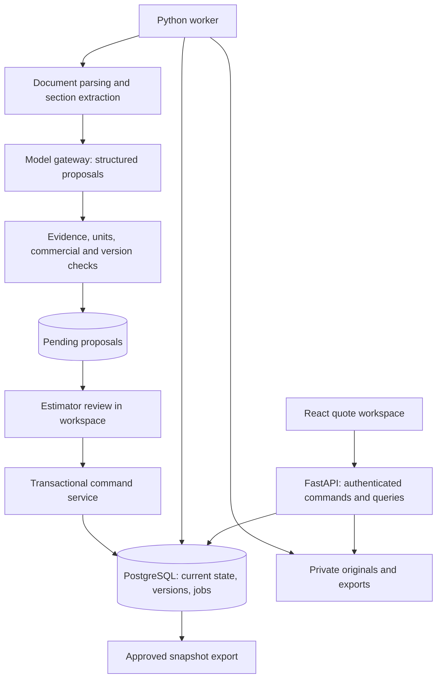

# Rivet — product and prototype architecture

Date: September 27, 2026. Archived product specification, updated to the user's final name, Rivet. See README.md for the implemented prototype and remaining scope.

## 1. Name and product promise

Product name: **Rivet**, as selected by the user. The product covers equipment quoting, revisions, submittals, and order handoff. No domain or trademark registration is implied by this prototype.

Product description: Rivet is an AI workspace for equipment quoting teams. It turns project documents into editable quote drafts, connects each important value to its evidence, and proposes quote changes when requirements change. People review exceptions and approve commercial outputs.

The essential engineering decision is to make the quote a structured, versioned business document. AI produces proposals against that document. Deterministic application code validates and applies authorized changes. Chat history is not business state.

## 2. Prototype scope and commercial assumptions

The first working loop is **upload → draft → review → addendum → requote → export**.

Initial workflow assumption: an equipment supplier preparing buy/sell quotations, with known supplier costs and explicit gross-margin policies. Use one selected equipment category and a small customer-provided catalog. A rep agency quoting on commission requires a different pricing policy; do not equate commission with gross margin. Confirm the pilot's commercial model before activating pricing.

Inputs:

- Text-based PDF specifications, schedules, supplier offers, and addenda.
- CSV/XLSX equipment schedules, catalogs, and price lists with user-confirmed column mappings.
- A pasted request or email body, with sender/date entered explicitly.
- An existing quote imported from CSV/XLSX when a customer wants to begin with revisions.

Outputs:

- Editable quote with sourced fields and unresolved items.
- Requirement-to-quote coverage view, including requirements without lines.
- Proposed changes with before/after values and supporting evidence.
- Draft clarification text for copying; no automated external messaging.
- Customer-facing PDF and XLSX export of a specific approved revision.
- Internal evidence/review report, separate from the customer quote.

Initial limits: one currency per quote; one primary cost offer per line; explicit quantity/price units; no autonomous engineering design, drawing takeoff, arbitrary cross-brand substitution, live inventory promises, portal automation, inbox integration, or ERP writes. Detect unsupported scanned pages and drawings and request transcription/review inside the product instead of silently treating them as empty. A later OCR adapter can extend ingestion.

Prototype can be single-user on localhost. Any shared pilot requires authentication and organization isolation described below. Synthetic demo packages must be visibly identified as synthetic, including fictional products, costs, lead times, and approvals.

## 3. Deployment shape and stack

Use a **modular monolith**: one source repository, a web client, a Python API, a Python worker from the same codebase, a PostgreSQL database, and private file storage. No microservices or autonomous agent network is needed.

| Layer | Choice | Responsibility |
| --- | --- | --- |
| Web client | React + TypeScript + Vite | Project inbox, quote grid, evidence panel, review flow |
| Grid | TanStack Table; TanStack Virtual when necessary | Row model, filtering, sorting, viewport rendering; implement editing and keyboard behavior explicitly |
| Server data | TanStack Query | Fetch, mutation invalidation, job-progress polling |
| PDF viewer | PDF.js | Display original PDF and highlight stored source regions |
| API | FastAPI + Pydantic | Typed requests/responses, permissions, command validation |
| Persistence | PostgreSQL + SQLAlchemy + Alembic | Business records, transactions, history, migrations |
| PDF parsing | pdfplumber | Text, tables, and word/page geometry |
| Spreadsheet parsing/export | openpyxl plus Python CSV library | Deterministic cell access, imports, XLSX exports |
| Worker | Separate Python process with PostgreSQL jobs | Resumable parsing, model calls, export jobs |
| Model integration | One server-side model gateway | Schema-constrained extraction and proposals, validated again in Python |
| File storage | Private local directory behind a BlobStore interface | Original documents and generated exports; replace adapter for remote storage later |
| Money | Python Decimal and PostgreSQL NUMERIC | Exact decimal arithmetic and explicit rounding |
| PDF export | Fixed HTML template rendered by Playwright/Chromium | Repeatable customer-facing quote output |

Do not copy dependency versions from unrelated projects. Resolve compatible stable versions at implementation and commit lockfiles. The existing decision-lab project uses React/TypeScript and Python, so this preserves familiar languages. Its single-row quote-import module is a reference for validation patterns, not a ready-made quote engine.



Use polling for job updates initially. Live collaborative text editing and CRDTs can wait; optimistic concurrency on quotes is mandatory from the start.

## 4. User interface

Four surfaces are sufficient:

1. **Projects:** customer, deadline, quote status, unresolved blockers, latest revision, processing state.
2. **Quote workspace:** project/document navigation at left; editable quote grid in the center; evidence, changes, or assistant in the right panel. The PDF can expand into a split view.
3. **Review changes:** grouped before/after changes, affected checks, approval requirements, accept/reject controls.
4. **Export review:** customer-facing preview, explicit terms/exclusions, final commercial review, approved revision number, download.

Grid columns: equipment tag, description, quantity, quantity unit, selected item/configuration, supplier cost, selling price, extended amount, lead-time status, review state. Internal cost and margin never enter customer exports by default.

Keyboard behavior: arrows navigate; Enter edits; Tab commits the current manual cell edit or an explicitly focused suggestion; Escape cancels. Tab must not silently approve an entire quote. Cmd/Ctrl-K opens a command for selected lines. Undo creates a checked compensating change rather than deleting history.

Keep field provenance separate from field review status:

- Origin: document extraction / imported value / calculated / human entered / model inference.
- Review: unreviewed / approved / rejected / stale.
- Check result: pass / fail / unknown / not applicable.

Display these as understandable labels such as “supplier offer, dated Sep 12,” “calculated from cost and margin,” or “needs confirmation.” A valid citation only establishes where a claim came from; it does not certify suitability or current availability.

## 5. Domain model

All domain rows belong to an organization. UUIDs identify business objects; line positions are display order only. Require same-organization references through composite foreign keys where possible. Timestamps use UTC; dates and lead-time calendars also retain their original meaning.

| Entity | Essential fields and purpose |
| --- | --- |
| Organization / Membership | organization_id, user_id, role; role determined by server session |
| Customer | organization_id, customer_id, name, commercial defaults |
| Project | customer_id, title, bid_due_date, required_on_site_date, input_revision, category |
| Document | project_id, kind, logical document identity |
| DocumentVersion | document_id, immutable blob key/hash, issue label/date, received_at, supersedes reference, parsing state |
| SourceSpan | document_version_id, page or sheet/cell range, normalized bounding boxes, exact text, parser version |
| Requirement | stable requirement_id, equipment tag/scope, attribute, operator, typed value/unit, evidence, origin |
| RequirementVersion | requirement_id, project input revision, active/superseded state, scope, precedence decision |
| CatalogItem | organization_id, manufacturer, model/configuration, typed attributes, evidence; imported catalog version |
| SupplierOffer | supplier, catalog/configuration reference, unit cost/currency/price basis, effective dates, lead-time conditions, evidence |
| Quote | project_id, customer_id, commercial_mode, currency, current_version, status |
| QuoteLine | stable line_id, quote_id, equipment tag, description, quantity/unit, catalog selection, supplier_offer_id, selling terms |
| LineRequirement | line_id, requirement_id, relationship; supports multiple requirements per line and multiple lines per requirement |
| FieldEvidence | object_id, field name, source_span_id or calculation record, reviewed snapshot, actor/time |
| Calculation | inputs and versions, formula/policy version, rounding rule, output |
| CheckResult | target, rule/version, pass/fail/unknown/not_applicable, evidence and explanation |
| Proposal | base quote/input revisions, actor/run, grouped typed operations, supporting sources, checks, pending/applied/rejected/stale |
| QuoteVersion | immutable quote snapshot, applied proposal id, actor/time, source/policy versions, checksum |
| Approval | quote version/input revision/policy hash, approver, scope, reason, timestamp |
| Export | approved version id, template version, audience, file key/hash, created_at |
| Job / RunStep | input snapshot, stage, status, attempts, lease token/expiry, output reference, model/prompt version, timings/cost |
| AgentRun / AgentTask / ToolCall | goal, pinned inputs, allowed tools, evolving plan, task dependencies, checkpoints, tool observations, budgets |
| MemoryRule | project/organization scope, approved content, supporting evidence, approver, version, expiry |
| AuditEvent | actor, action, entity, version, timestamp; append-only application history |

For the prototype, flexible requirement attributes, line metadata, and immutable quote snapshots may be JSONB. Keep monetary values, identifiers, relations, state, and searchable commercial fields explicit. Do not build a graph database or full event-sourced application. Relational dependency tables plus version snapshots are sufficient.

An extracted requirement, a candidate product, a supplier offer, and a customer quote line are different objects. For example, “300 kVA required” is not a product selection, and selecting a product does not prove its price or delivery date.

## 6. Ingestion and evidence preservation

Upload sequence:

1. Authorize the upload against the current organization/project. Check size/type, generate storage keys, and calculate a file hash.
2. Persist original bytes privately and a DocumentVersion record. Never overwrite an original. Mark any interrupted upload for cleanup/recovery.
3. Increment project input_revision and mark affected quote readiness as needing reconciliation. New relevant documents must not leave an old approval looking current while parsing is pending.
4. Enqueue parsing using a unique document-version/parser-version key.
5. Extract text/table structure and page geometry. Preserve page orientation and coordinate conversion for PDF.js highlighting.
6. For spreadsheets, store sheet and cell coordinates, displayed/cached values, and formula text separately. Do not execute macros; treat formula cells without usable cached values as unresolved.
7. Produce a page/sheet coverage manifest: processed, empty, failed, scanned, unsupported. Show incomplete coverage in the UI.
8. Split by document sections and table boundaries. Preserve headings and equipment tags. Avoid fixed text chunks that detach numbers from table headers and units.

A source span references an immutable document version. The server verifies that model-provided span IDs exist in the current organization's allowed input set. Persist exact supporting excerpts; do not let the model invent coordinates or source identifiers. For ambiguous geometry, link to the page and identify the region as approximate.

Read every relevant schedule section when generating the initial line list. Retrieval alone cannot prove completeness. Use project-scoped full-text search for questions and exact identifier search for products. Embeddings are an optional later improvement, not the authority for completeness or compliance.

## 7. Extraction, matching, and drafting

The following functions are reusable workflow stages. The agent runtime in section 10 chooses, repeats, and branches between them as evidence requires; they are not a single fixed sequence of prompts:

`parse_documents → extract_requirements → reconcile_scope → resolve_candidates → attach_offers → calculate_quote → validate → propose_changes`

### Extraction

Give the model source span IDs and a strict output schema. Extract equipment tags, quantities, units, requirements, exclusions, deadlines, and explicit uncertainties. Every consequential extracted value needs evidence or an explicit human-entered/inferred label. Missing values are null/unknown, never zero.

Pydantic rejects unknown fields, malformed types, impossible values, and invalid source references. Allow a bounded repair retry for malformed model output; then fail the stage visibly. Record extraction omissions or unreadable sections for review.

### Scope reconciliation

Match stable equipment tags and explicit source relationships first. Detect duplicate references across schedules and specifications; do not sum repeated mentions as additional quantity. Store alternatives, optional scope, base scope, and exclusions distinctly. Unresolved references remain requirements without quote lines so omissions remain visible.

Document precedence is explicit. An addendum can supersede selected clauses while the rest of the original remains in force. Upload order and file date alone do not establish authority. Ask the reviewer to resolve conflicting sources.

### Product candidates

Search the small authorized catalog by exact model/alias and structured filters. Each candidate has a requirement comparison with pass/fail/unknown per modeled property. Preserve exclusions and package-level dependencies. Category-specific checks must come from domain review; the prototype must not claim complete engineering equivalence.

Unknown or conflicting attributes prevent “fully matched” status. A model can propose a candidate and explain it, but cannot fabricate a model number, manufacturer approval, or available offer. Initially, an estimator may select the product manually while the system drafts the rest.

### Offers and pricing

An offer identifies cost, currency, quantity basis, effective dates, scope, and delivery conditions. Explicitly distinguish price per item, per foot, per hundred units, or per package. Permit only reviewed unit conversions. Expired or incomplete offers cause a review item.

Compute money in application code with Decimal. For gross margin m:

`selling_price = cost / (1 - m)`

For markup u:

`selling_price = cost * (1 + u)`

These are separate commands. If “at 18%” is ambiguous, request the intended basis instead of choosing silently. Reject margin >= 100%. Specify rounding at unit/line/total levels and retain calculation inputs. For example, an illustrative USD 8,000 cost at 20% gross margin is USD 10,000 selling price, not USD 9,600.

Support product discounts and freight only through explicit typed fields and policies. Unsupported taxes, currencies, tiers, or commission structures must be identified as unresolved, not estimated by the model. Manual selling-price overrides record the user and reason and re-evaluate margin policy.

### Lead time

Represent quoted duration/range, source date, trigger event, trigger date if known, shipment versus arrival basis, transit allowance, calendar basis, and confirmed/estimated status. If an offer says “20 weeks after approved submittal,” an unknown approval date means an unknown arrival date. Do not add 20 weeks to today.

Only calculate a schedule comparison when the relevant inputs exist. Otherwise show what must be confirmed. This module is optional to the initial commercial value; requoting can succeed without live lead-time intelligence.

## 8. Proposal and command engine

All manual and AI changes use the same server-side domain commands. AI changes stop at pending proposals. A permitted manual edit is an explicitly authorized command; it still gets validation and history.

Initial command vocabulary:

- add_line, remove_line, set_quantity, update_description
- select_catalog_item, attach_supplier_offer
- set_gross_margin, set_markup, override_selling_price
- link_requirement, attach_evidence, record_assumption
- accept_proposal, reject_proposal, approve_quote
- create_export, propose_revert

Natural-language commands can request these operations; they cannot name arbitrary database fields, execute SQL, invoke shell commands, send messages, or change permissions.

Example of a pending quantity change:

```json
{
  "proposal_id": "prp_014",
  "quote_id": "q_001",
  "base_quote_version": 7,
  "base_input_revision": 4,
  "policy_version": "pilot-buy-sell-v1",
  "status": "pending",
  "groups": [
    {
      "group_id": "grp_1",
      "summary": "PDU quantity increased in Addendum 2",
      "operations": [
        {
          "type": "set_quantity",
          "line_id": "line_pdu_01",
          "expected_before": {"value": "8", "unit": "each"},
          "after": {"value": "10", "unit": "each"},
          "source_span_ids": ["span_add2_p4_r6"]
        }
      ]
    }
  ]
}
```

IDs above are illustrative; production IDs are server-assigned UUIDs. The client may select an operation group but may not modify its validated contents during acceptance. Changed contents require a new proposal.

On apply, in one database transaction:

1. Resolve actor and organization from authentication; authorize the command.
2. Check the idempotency key. Return the prior committed result for an exact retry.
3. Lock the quote and relevant project input-version row using a consistent lock order.
4. Compare expected quote version, input revision, evidence/catalog/policy versions, and before-values.
5. Validate the complete selected group and calculate derived fields/checks server-side.
6. Apply changes atomically, invalidate affected approvals, and save the next quote snapshot and audit records.
7. Mark the group applied and commit the result and idempotency record together.

Never hold a database transaction open while waiting for a model call.

Prototype concurrency rule: reject stale proposals with HTTP 409. Regenerate remaining proposals against the new version after an accepted group. Do not silently merge old agent work over newer human edits. Related changes such as product + offer + price form one atomic group.

Hard failures such as cross-organization references, malformed quantities, stale versions, or unsupported currency cannot be waived. Business exceptions require an explicit authorized disposition and reason. A failed requirement must remain visible even when a commercial exception is approved; approval must not turn failure into “pass.”

Quote state: draft → in_review → approved. Any meaningful change produces a new draft version and invalidates current approval. Export is a recorded action on an immutable approved version, not proof that a customer received or accepted it. Mark old exports superseded when applicable.

Undo/revert is a new checked command restoring selected prior values. If dependencies changed, generate a proposal or conflict instead of blindly replaying the inverse. Old approvals never carry over automatically.

## 9. Addendum processing

The revision feature needs both textual and semantic comparison:

1. Parse the new document version and retain the original.
2. Align sections, equipment tags, and table rows to the relevant prior document; page numbers are not stable identities.
3. Identify explicit additions, removals, replacements, and changed requirements.
4. Propose which prior requirements are superseded. An omitted row in a partial addendum is not automatically a deletion.
5. Find impacted quote lines through LineRequirement and FieldEvidence links.
6. Also find new requirements with no quote line and affected package-level assumptions.
7. Re-run applicable product, offer, pricing, and delivery checks.
8. Produce grouped edits plus an impact report. Show unchanged, changed, new, unresolved, and not-analyzed scope separately.

Use deterministic comparison for explicit typed values. Use the model to interpret ambiguous wording with evidence and uncertainty. Do not send the two entire PDFs to a model and trust a prose summary as the revision engine.

A change to a shared requirement may affect many lines. Invalidating those dependencies is the core reusable mechanism behind future submittal and order-update features.

## 10. Full agent runtime and user workflow

The agent runtime is a first-class application subsystem. It takes a user goal or authorized event, builds context, chooses a plan, calls tools, inspects results, repairs its work, and delivers a reviewable artifact or a specific request for human input. The surrounding domain model gives it persistent state and a way to verify progress.

Use one capable, schema/tool-capable model through a server-side adapter selected from the builder's existing provider setup. This specification does not provision a model account or assume a particular model name. A single model can serve multiple bounded roles; logical specialists do not require separately deployed services.

### 10.1 Entry points

All entry points use the same runtime and permission policy:

- User: “Build the quote from this bid package.”
- User: select lines and request a margin change, candidate alternatives, or a comparison.
- User: “Update this quote for Addendum 3.”
- Event: a newly uploaded addendum starts analysis if automatic drafting is enabled.
- Later connector event: a new RFQ email, supplier response, or approved price-list revision starts the permitted workflow.

Prototype uploads and manual commands are real triggers. Inbox, ERP, and live supplier triggers remain planned until their connectors are implemented. A new document invalidates relevant previous assumptions; it does not authorize applying commercial changes.

### 10.2 Durable run state

Create an AgentRun record referencing organization, actor, goal, trigger, project, quote version, input revision, policy version, allowed tools, budget, status, active plan, and result proposal IDs. Store a task list with explicit dependencies and checkpoint each completed tool call.

State machine: queued → gathering_context → planning → executing → verifying. Verification returns to executing when repair is possible, otherwise proceeds to waiting_for_input, ready_for_review, or completed. Any active state can terminate as failed or cancelled. Approval is a separate business event, not a model-selected run state.

Persist observable plans, tool requests/results, artifact references, and concise decision summaries. Hidden model reasoning is neither required nor used as the audit record.

### 10.3 Context builder

Assemble a compact, server-authorized context containing:

- Current goal, selected lines, quote version, and prior approved decisions.
- Source inventory with document kinds, versions, section headings, and coverage gaps.
- Relevant requirements, catalog scope, offers, unresolved questions, and commercial rules.
- Approved organization preferences and the current tool catalog.
- Task status and references to previous stage outputs.

The agent retrieves full source spans on demand. It need not reread an entire bid book each turn, but completeness checks still cover every relevant schedule/section. Context summaries are navigation aids; immutable records and source spans remain authoritative.

### 10.4 Planner and execution loop

The planner creates a short actionable plan with task dependencies, required outputs, and completion criteria. It can revise that plan based on tool results. For example, discovering that a requested product is absent from the catalog should cause an alternatives search or a clarification, rather than fabrication or automatic termination.

The runtime repeatedly:

1. Loads the persisted run and checks cancellation, budget, permissions, and input-version changes.
2. Builds the next context from current task outputs and authorized evidence.
3. Asks the model for a tool call, plan update, human-input request, or finish proposal.
4. Validates and executes allowed tool calls; parallelizes independent reads only.
5. Persists results and proposed draft edits with their dependency versions.
6. Runs deterministic checks and updates the unresolved-item list.
7. Repairs a fixable issue, asks a specific question, or presents an artifact for review.

A model's “done” response is only a request to finish. The runtime evaluates the declared completion criteria before marking the result ready. A reviewable draft can contain explicit unresolved items; an approved customer quote has stricter requirements.

Initial configurable guardrails: a bounded tool-step budget per task, run cost/time limits, limited repair attempts, and no-progress detection based on repeated calls/results. Large packages are partitioned into persisted tasks instead of failing merely because they need more work. When a limit is reached, preserve progress and surface the remaining work.

### 10.5 Tool surface

| Tool | Result and authority |
| --- | --- |
| read_project / read_quote | Versioned, organization-scoped business state |
| list_documents / inspect_coverage | Source inventory and parsing gaps |
| search_sources / read_source_spans | Authorized evidence with immutable IDs |
| extract_requirements | Structured requirements and explicit uncertainty |
| compare_document_versions | Proposed semantic changes and source alignment |
| find_catalog_candidates | Actual catalog records; no invented products |
| compare_requirements | Typed checks plus unresolved category judgments |
| get_supplier_offers | Actual imported offers and validity/condition fields |
| calculate_prices / evaluate_delivery | Deterministic calculations with inputs and explanations |
| stage_draft_changes | Writes to the run's isolated proposal overlay only |
| inspect_draft / validate_draft | Current tentative quote, check results, coverage, and inconsistencies |
| draft_clarifications | Proposed questions, recipient context, and supporting evidence; no send |
| request_human_input | Persists the exact decision needed and pauses dependent tasks |
| finalize_proposal | Produces a frozen reviewable change set if runtime criteria pass |

Approval, customer sending, purchasing, and ERP writes are absent from the agent's prototype tool set. Context determines which subset of tools is exposed, and the server independently enforces that allowlist. Direct internal tools are sufficient; MCP can be an integration boundary later without replacing domain validation.

### 10.6 Isolated draft workspace

Give each run a proposal overlay based on an immutable quote version. This is a tentative branch the agent can edit, inspect, calculate, and revise without changing the accepted quote. The UI may stream it as “agent draft.”

Each operation is logged with provenance. The agent can replace its own pending proposal through a new recorded draft revision, but cannot rewrite accepted human work. At finalization, produce stable atomic groups against the current baseline. If relevant live state changed, rebase through the same version checks or stop with a conflict. The eventual accept operation still uses the transactional command engine in section 8.

### 10.7 Specialists and parallel work

The full product can expose bounded specialist roles behind a single customer-facing agent:

- Document specialist: inspect sections, extract evidence, and resolve references.
- Selection specialist: investigate catalog candidates for one equipment group.
- Revision specialist: trace changed requirements to affected quote lines.
- Review specialist: look for omissions and unsupported conclusions in a fresh bounded context.
- Clarification specialist: assemble the questions that remain after investigation.

Pricing and date arithmetic remain deterministic tools. Initially, one supervisor can execute all roles with named task routines. Add separate subagent contexts when measured context size or latency warrants them, especially for independent equipment packages. Each subagent receives a scoped task, source permissions, a budget, and an output schema, and returns evidence-backed results. It cannot approve or mutate the shared quote.

The supervisor reconciles conflicting outputs before creating edits. Parallel work operates on pinned snapshots; task dependency checks prevent merging results based on incompatible requirements. A model reviewer can identify suspected errors but is not an independent proof of correctness.

### 10.8 Verification, repair, and interruption

Verification combines structural validity, evidence checks, deterministic pricing/units, requirement coverage, candidate checks, and an optional semantic review. Failed checks are tool observations the agent can act on.

Example: an illustrative draft has eight PDUs, an addendum requires ten, and an existing offer covers only eight. The agent detects the quantity change, finds the offer's scope limit, stages the new quantity as unresolved for pricing, and drafts a supplier clarification. It must not assume the eight-unit offer applies unchanged to ten.

When the user answers a question, persist the answer with actor/time and any attached supplier evidence. A new answer becomes a versioned input. Resume the run from its checkpoint, reconcile against current state, and recheck only affected dependencies. A user assertion and a supplier confirmation remain distinguishable evidence types.

When a user edits during a run, pause or invalidate affected tasks; unrelated tasks can continue. Cancellation stops future work and preserves completed artifacts. A provider outage leaves manual editing and saved evidence usable.

### 10.9 Memory and improvement

Use three explicit stores:

- Run memory: task progress, retrieved evidence references, tentative decisions, and unresolved questions.
- Project memory: approved assumptions, chosen alternatives, prior quote revisions, and customer clarifications.
- Organization memory: explicitly approved rules, templates, manufacturer mappings, and commercial defaults with scope and expiry.

Historical quotes are retrieved as examples, not copied as current prices or proof of compliance. A human correction is logged as a candidate improvement; do not silently turn one exception into a company-wide rule. Rule changes require approval and regression evaluation. Cross-customer learning requires separate data rights and is outside prototype scope.

### 10.10 What the user sees

Show observable progress such as “Read equipment schedule,” “Comparing 12 candidate items,” “Found a conflict between two revisions,” and “Need current pricing for three lines.” Display the evolving draft alongside pending tasks and sources. Do not expose hidden chain-of-thought or pretend an activity summary is proof of correctness.

The final agent delivery contains: the draft/diff, completed checks, unresolved decisions, drafted clarification questions, and a clear next action. After human approval it can prepare authorized export artifacts; it does not imply that the quote was sent.

The prototype's agent acceptance test is adaptive: given an unseen supported package with one missing price, one conflicting requirement, and an addendum, the agent must discover the gaps, select useful tools, avoid inventing answers, request specific human input, resume after the answer, and produce the correct reviewable changes. A hardcoded progress animation or a fixed prompt chain does not satisfy this test.

### 10.11 Implementation boundaries and observability

Add backend/agents/{runner,context,planner,tools,verifier,memory}.py plus role prompts and schemas to the suggested repository. The worker runs the agent runner; the API starts runs, returns progress, accepts answers, and cancels runs. Suggested additional routes: POST /quotes/{id}/agent-runs, GET /agent-runs/{id}, POST /agent-runs/{id}/answers, POST /agent-runs/{id}/cancel. Every route enforces organization and actor scope.

Store model identifier, prompt/schema version, input hashes, tool/step status, proposal references, repair counts, latency, and model cost where available. Avoid raw confidential documents in general-purpose logs. Keep model-provider keys server-side. Treat source instructions as untrusted data, not as changes to permissions or policies.

For speed, keep grid editing and math synchronous in application code. Cache extraction by organization-scoped content hash and implementation versions. Use a capable model initially; introduce smaller models or reusable task recipes after evals establish equivalent quality. No model call is required for every keystroke or recalculating totals.

## 11. Durable jobs and failure recovery

Persist a Job before returning HTTP 202. The worker claims a job using a short transaction and `FOR UPDATE SKIP LOCKED`, records a lease token and expiry, and commits before doing work. Heartbeat long jobs. Finish a job only if its lease token still matches; a restarted worker cannot overwrite a newer worker's result.

Unique keys based on organization, task, input snapshot, and implementation version prevent duplicate persisted outputs. At-least-once execution is acceptable; exactly-once external model billing is not promised. Reuse persisted stage results rather than rerunning the whole document after a crash.

Persist stage outputs for parse, extraction, matching, proposal creation, and export. Retry transient failures with bounded exponential backoff, a maximum attempt count, and a run cost/time budget. Do not retry permission errors or unsupported documents indefinitely. A cancellation flag is checked between stages. User-visible states are queued / running / waiting_for_review / succeeded / failed / cancelled.

FastAPI in-process background tasks are not the durable record for the ingestion pipeline. There is no need to introduce Redis or a distributed workflow service for the first prototype; introduce a mature queue/workflow engine if operating the custom queue becomes material work.

## 12. API surface

All write operations validate organization membership, expected versions where applicable, and idempotency keys. Generate frontend API types from the backend OpenAPI schema rather than maintaining conflicting schemas manually.

| Route | Purpose |
| --- | --- |
| POST /projects | Create a customer project |
| GET /projects/{id} | Project, input revision, coverage, quote summaries |
| POST /projects/{id}/documents | Upload a version and enqueue ingestion |
| POST /projects/{id}/imports | Import catalog, offers, schedule, or existing quote with reviewed mapping |
| POST /projects/{id}/quotes | Create an empty quote or start drafting |
| GET /quotes/{id} | Current structured quote, checks, version, pending proposals |
| POST /quotes/{id}/commands | Manual edits or natural-language requests with selection context |
| GET /quotes/{id}/proposals | Pending and historical proposed changes |
| POST /proposals/{id}/accept | Accept an atomic group against expected versions |
| POST /proposals/{id}/reject | Reject with optional reason |
| POST /quotes/{id}/revisions/analyze | Analyze a selected addendum against a pinned baseline |
| POST /quotes/{id}/questions | Evidence-based project question; no writes |
| POST /quotes/{id}/approve | Approve a specific version after current checks |
| POST /quotes/{id}/exports | Generate an approved customer export or labeled internal draft |
| GET /quotes/{id}/history | Versions, edits, approvals, exports |
| GET /jobs/{id} | Progress, failure reason, recoverable actions |
| GET /documents/{id}/content | Authorized access to original content |
| GET /sources/{id} | Authorized evidence and source location |

Use 422 for invalid structured input, 403 for forbidden operations, 409 for stale state, and 202 for queued work. Long model runs do not block an open HTTP request.

## 13. Files, exports, and pilot access

Local development binds to localhost, with a seeded organization and development identity. This bypass must be disabled before network access. A shared pilot needs authenticated sessions, server-enforced roles, organization-scoped data access, private blobs, and protection against cross-site mutation. Do not trust organization_id or approver roles supplied by the browser.

Keep provider secrets in server configuration. Apply limits to uploaded files and parser execution. Do not run spreadsheet macros or instructions embedded in documents. Avoid logging raw cost tables or customer files; use IDs and diagnostic metadata.

Customer export is an explicit allowlist: customer/project, approved products/configurations, quantities, selling amounts, lead-time wording, validity, scope, assumptions, exclusions, terms, and revision identifier. Internal cost, margin, internal discussions, and supplier-private attachments are excluded unless deliberately included by an authorized export policy.

Export from an immutable quote snapshot, not the current grid. Save template version and file hash. Render PDFs and inspect pagination before pilot use. An internal draft must be visibly labeled draft. Approval and export never automatically send email.

Keep a documented retention/deletion policy for pilot data and a tested database/file backup. Original files are immutable during their retained lifetime, not exempt from authorized deletion.

## 14. Suggested repository boundaries

```text
rivet/
  apps/
    web/src/
      projects/
      quote-grid/
      evidence/
      proposals/
      assistant/
      exports/
  backend/
    api/
    domain/
      requirements.py
      quotes.py
      commands.py
      pricing.py
      checks.py
      approvals.py
    ingestion/
      pdf.py
      spreadsheets.py
      spans.py
      coverage.py
    workflows/
      draft_quote.py
      revise_quote.py
      export_quote.py
    ai/
      gateway.py
      schemas.py
      prompts/
    storage/
      models.py
      blobs.py
      jobs.py
    worker.py
  migrations/
  evals/
    synthetic/
    authorized_customer_cases/
    expected/
  tests/
  docs/
```

These are proposed files, not generated application code. Build this separately from the existing project-controls and epistemic-security prototypes. Reuse reviewed implementation patterns where appropriate without changing those products' domain models.

## 15. Build order and acceptance gates

### Slice 1 — a correct manual quote editor

Implement projects, private uploads, quote lines, decimal pricing, manual edits, immutable versions, history, and customer export. Use one synthetic category and known offers.

Pass: edit/reload/export preserves values; gross margin differs correctly from markup; units and price bases are explicit; exported customer files omit internal costs; manual edits produce history.

### Slice 2 — grounded agentic draft preparation

Add parsing, source spans, page coverage, the resumable agent loop, context builder, scoped tools, isolated draft overlay, validation/repair, human-input pause/resume, pending proposals, and review. Start with schedule PDFs and CSVs before complex bid books. Use one supervisor first.

Pass: user can upload an unseen supported schedule; the agent chooses tools, drafts supported lines, investigates missing evidence, and asks a targeted question when needed. The user answers, the run resumes, and the result can be reviewed and persisted/exported. Scanned/unparsed pages and missing required values cannot silently disappear.

### Slice 3 — addendum to proposed requote

Implement stable equipment/requirement identities, section alignment, supersession, dependency invalidation, grouped changes, and stale-write rejection.

Pass: a new addendum changing quantity and delivery wording produces the intended proposed changes, identifies new requirements, leaves unrelated fields untouched, and invalidates affected review. An older proposal cannot overwrite a newer human edit.

### Slice 4 — commands and pilot readiness

Extend the existing agent runtime with selected-line natural-language commands, question answering with citations, approved memory, richer clarification drafts, authenticated pilot access, and time/review instrumentation. Add specialist contexts only if measured workload warrants them.

Pass: a real estimator completes an authorized RFQ or revision and compares total preparation plus review time with their current process. Repeat usage and willingness to pay are measured independently of demo quality.

## 16. Verification and evaluation

Deterministic tests should cover:

- Gross-margin/markup calculations, decimal rounding, discounts, freight, units, missing costs, and offer validity.
- Scope duplication across documents, shared requirements, partial addenda, new requirements without a line, and ambiguous precedence.
- Tenant isolation on records, evidence retrieval, jobs, and export files.
- Duplicate acceptance, job retries, expired leases, concurrent edits, stale input revisions, rollback, and revert.
- Approval invalidation and approved-snapshot export; internal-field leakage.
- Model timeout/refusal/malformed output, fabricated source IDs, unsupported pages, and instructions embedded in documents.

Use a small synthetic suite first, then authorized customer cases held out by project. Historical final quotes may include undocumented human decisions or errors; label expectations with an estimator instead of treating every historical value as unquestionable ground truth. Freeze the documents available at each historical revision to avoid hindsight leakage.

Measure separately: requirement/line recall, field accuracy, citation correctness, revision-impact precision/recall, unsupported-value rate, correction count, total user preparation/review time, onboarding/support time, run latency, and model cost per quote. Material missed changes and invented prices deserve separate reporting rather than being hidden in an overall accuracy average.

Pilot success thresholds should be agreed with the customer around error severity and real time saved. No universal percentage in this document establishes engineering correctness or market demand.

## 17. What expands later

After the core loop proves useful: an email connector that creates intake records; category-specific product compatibility checks; supplier offer refresh; scoped OCR; submittal assembly from accepted lines; approved order export; direct ERP integration; rep-agency commission policy; multi-currency; collaboration presence; and richer retrieval.

Each addition must reuse the same evidence, command, version, and approval model. External sending or ERP writes require separate explicit actions, idempotency, reconciliation, and permissions; they are not extensions of a chat response.

## 18. Technical references

These references support component capabilities; the domain design and build sequence above are recommendations for this product.

- [TanStack Table overview](https://tanstack.com/table/latest/docs/overview): headless table model; editing/navigation are application work.
- [TanStack React virtualization guide](https://tanstack.com/table/latest/docs/framework/react/guide/virtualization): combine the table with a virtualization layer when needed.
- [pdfplumber](https://github.com/jsvine/pdfplumber): PDF text/table extraction and word bounding boxes.
- [PDF.js](https://mozilla.github.io/pdf.js/): browser PDF rendering.
- [FastAPI background tasks](https://fastapi.tiangolo.com/tutorial/background-tasks/): background execution guidance; keep durable pipeline state separately.
- [PostgreSQL SELECT](https://www.postgresql.org/docs/current/sql-select.html): locking clauses, including SKIP LOCKED for queue-like access. Leasing, retries, and idempotency remain application responsibilities.
- [Anthropic: Building agents with the Claude Agent SDK](https://claude.com/blog/building-agents-with-the-claude-agent-sdk): context/action/verification loops and scoped subagents; this specification uses those architectural ideas without requiring that SDK.
- [Anthropic: Building effective agents](https://www.anthropic.com/engineering/building-effective-agents): distinctions between predefined workflows and model-directed tool use.
